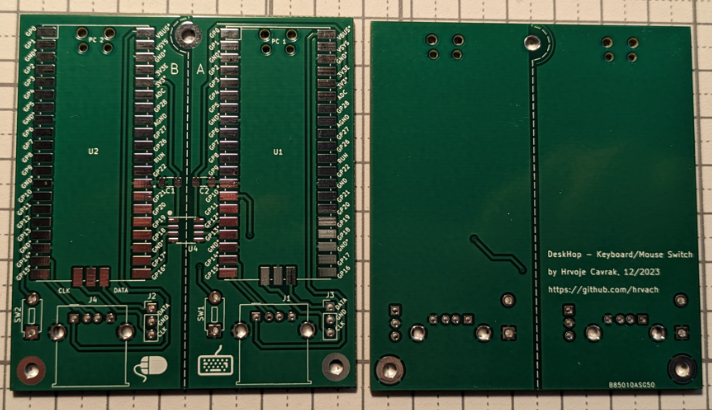
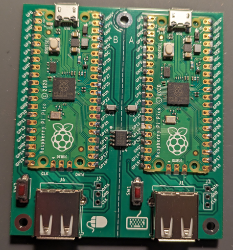

# DeskHop - Fast Desktop Switching

## 概要 (Overview)

このプロジェクトはhttps://github.com/s51517765/deskhop のForkです。

[Original README.md](README_original.md)

以下はオリジナルより引用。

テクノロジーのクレイジーな世界では、競合相手が左利き用ドライバーと自動的に隠れる目覚まし時計だけかもしれないほどニッチな問題を解決しようとする、風変わりな小さなプロジェクトが常に存在することに気づいたことがありますか?

私は毎日のワークフローで 2 台の異なるコンピューターを使用しており、それらの間で 1 つのキーボードとマウスのペアを共有しています。 Amazon で見つけたいくつかの USB スイッチング ボックスを試してみたところ、どれも同様の問題を抱えていることがわかりました。切り替えには時間がかかり、ボタンを探すときのプロセスは非常にぎこちなく、率直に言って、時間が経っても改善されません。

私が欲しかったのは、キーボード ショートカットを使用して出力をすばやく切り替える方法と、マウス ポインタを魔法のようにモニタ間で移動することで同じことを行う機能です。 このプロジェクトを使用すると、コンピュータで異なるオペレーティング システムが実行されている場合でも、両方を行うことができます。

## オリジナルとの差分（Differences from Original）

タクトスイッチ（Board B）にPC Bのマウス速度を切り替える機能を追加

## 動画 (Movie)

https://twitter.com/s51517765/status/1760995792129872011

## 実装イメージ (Pictures)

オリジナルに対して、タクトスイッチを2つ追加している。

## 動作要件 (Requirements)

RaspberryPi Pico / C++

## 部品リスト (Parts List)

|部品|種類|数量|秋月コード|価格|
| ------------- | ------------- |------------- |------------- |------------- |
|基板取付用USBコネクタ|Aタイプ メス|2個|115180|50*2|
|タクトスイッチ|TVBP06-B043CR-B|2個【オプション】|108213|20*2|
|デジタルアイソレーター|ADuM121N1BRZ|1個|113619|320|
|チップ積層セラミックコンデンサー|0.1μF100V C0G 3216|1パック5個入|115180|120|
|Raspberry Pi Pico|-|2個|116132|770*2|
|USB Type B microケーブル|-|2個|-|-|

部品についてはオリジナルの部品リストから、同等のものを秋月電子のラインナップから選定した。USB Type B microケーブルについては一般的なものが使用できるはずである。

## ライセンス (License)
 GNU GENERAL PUBLIC LICENSE Version 3, 29 June 2007